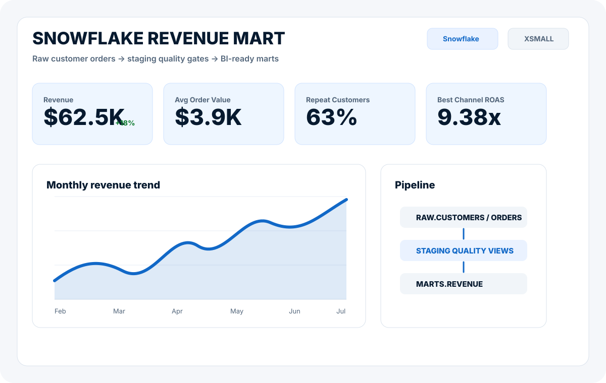

# Snowflake Customer Revenue Mart

Snowflake-ready analytics engineering project that turns raw customer, order, and marketing data into BI-ready revenue marts.

## What It Shows

- Snowflake database, warehouse, schema, and role setup with cost guardrails.
- Raw-to-staging-to-mart SQL modeling.
- Revenue, AOV, repeat-customer, CAC, and ROAS reporting views.
- Small quality checks for duplicates, orphan orders, null keys, and revenue reconciliation.

## Architecture



```text
CSV / operational extracts -> RAW tables -> STAGING views -> MART tables -> BI dashboard
```

## Repo Structure

```text
data/                       Sample source extracts
sql/01_setup.sql            Snowflake warehouse, database, schemas
sql/02_seed_sample_data.sql  Worksheet-friendly sample data inserts
sql/03_transform_marts.sql  Staging and mart models
sql/04_quality_checks.sql   Data quality and reconciliation checks
assets/                     Dashboard / architecture preview
```

## Run Order

Open a Snowflake worksheet and run the SQL files in this order:

1. `sql/01_setup.sql`
2. `sql/02_seed_sample_data.sql`
3. `sql/03_transform_marts.sql`
4. `sql/04_quality_checks.sql`

The setup uses an `XSMALL` warehouse with `AUTO_SUSPEND = 60` to keep trial usage low.

## Example Mart Outputs

- `MARTS.MART_MONTHLY_REVENUE`: monthly revenue, orders, AOV, and customer counts.
- `MARTS.MART_CHANNEL_PERFORMANCE`: revenue, spend, CAC, and ROAS by acquisition channel.
- `MARTS.MART_CUSTOMER_REVENUE`: lifetime revenue and customer segment signals.

## Status

Active work. The SQL and sample data are ready to run in Snowflake; the next step is connecting the marts to a dashboard once the Snowflake trial workspace is configured.
